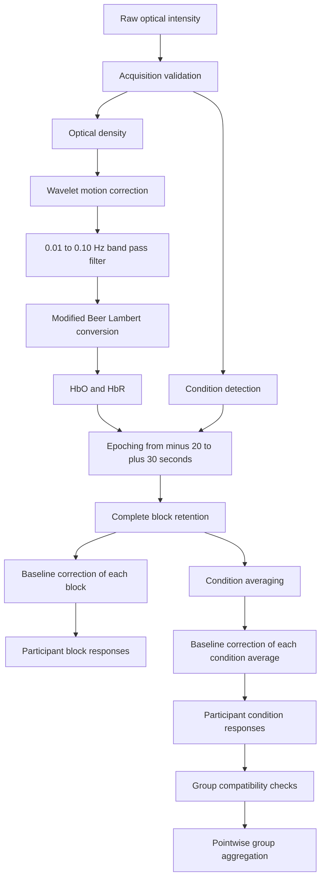

# fNIRS Vestibulo Oculomotor Preprocessing

This repository contains MATLAB code for preprocessing continuous wave fNIRS recordings collected during vestibulo oculomotor tasks. The pipeline converts raw optical intensity measurements into HbO and HbR responses, extracts condition specific epochs, preserves individual task blocks, computes participant condition averages, and generates group summaries with pointwise quality control.

## Overview

The software accepts Homer `.nirs` recordings and returns hemodynamic response data with explicit time, channel, condition, and block organization. Loading, acquisition validation, condition detection, Homer2 numerical operations, epoch extraction, baseline correction, and group aggregation are implemented as separate functions with documented input and output contracts.

The processing functions do not assign biological meaning to the HbO and HbR responses. Acquisition requirements and processing parameters must be reviewed for each study protocol.

## Processing Pipeline



## Key Features

1. Homer `.nirs` loading with native Homer2 probe metadata kept separate from the standardized recording structure.
2. Acquisition checks for sampling, measurement, wavelength, and channel structure.
3. Exact condition name matching and explicit trial count reporting.
4. Homer2 calls isolated behind small wrapper functions with input and output checks.
5. Complete block retention with original event ordinals.
6. Separate participant block responses and condition average responses.
7. Group compatibility checks for condition names, time vectors, dimensions, and channel order.
8. Synthetic MATLAB tests for processing boundaries and error behavior.

## Processing Parameters

The default configuration applies the following choices:

1. Wavelet motion correction with IQR equal to `1`.
2. One `0.01 to 0.10 Hz` band pass filter applied to motion corrected optical density.
3. Modified Beer Lambert conversion to HbO and HbR.
4. An epoch window from minus 20 to plus 30 seconds.
5. A baseline interval from minus 20 to 0 seconds.
6. Retention of complete blocks only.
7. Pointwise group exclusion for values strictly greater than `2` sample standard deviations from the initial mean.
8. One exclusion pass with no imputation.
9. Recalculation of the group mean and sample standard deviation from retained values.

The differential pathlength factor is configurable. The default value in `canonical_preprocessing_config` is `[6 6]`.

## Outputs

`preprocess_recording` returns participant responses and processing records:

| Output | Dimensions | Contents |
|---|---:|---|
| `block_hrfs(k).HbO`, `.HbR` | time x channel x retained block | Baseline corrected complete block responses |
| `condition_hrfs(k).HbO`, `.HbR` | time x channel | Baseline corrected condition averages |
| `epoch_report(k)` | one record per condition | Detected, retained, and boundary excluded block counts |
| `preprocessing` | one structure | Numerical parameters used for the recording |

Each response contains a column `time` vector and a `channel_pairs` matrix that records source and detector indices in the maintained channel order. `block_indices` records the original event ordinal for every retained block. Individual retained blocks are preserved so later analyses can select an appropriate time window.

`aggregate_participant_hrfs` returns group condition responses with dimensions `time x channel`. Its quality control report contains the initial mean, initial sample standard deviation, final sample standard deviation, exclusion mask, and pointwise included and excluded counts for HbO and HbR.

## Repository Structure

```text
config/          Processing parameters and a local path template
src/individual/  Loading, validation, Homer2 wrappers, epoching, and preprocessing
src/group/       Pointwise exclusion and participant aggregation
tests/           MATLAB tests using synthetic inputs and temporary stubs
docs/            Processing methods and software data flow
examples/        Function call sequence and input contract notes
scripts/         Guidance for user maintained runner scripts
```

## Requirements

1. MATLAB R2022b, which is the version used for the current test suite.
2. A compatible Homer2 installation for real preprocessing. The MATLAB path must provide `hmrIntensity2OD`, `hmrMotionCorrectWavelet`, `hmrBandpassFilt`, and `hmrOD2Conc`.

The maintained source does not directly call another MATLAB toolbox API. A Homer2 installation may have its own dependencies.

## Quick Start

The example below follows the maintained function signatures. The caller supplies the recording path and acquisition requirements.

```matlab
addpath('config');
addpath(fullfile('src', 'individual'));
addpath(fullfile('src', 'group'));

config = canonical_preprocessing_config();

[recording, adapter_context] = load_fnirs_recording(raw_file);

requirements = struct( ...
    'expected_sampling_rate_hz', expected_sampling_rate_hz, ...
    'sampling_rate_tolerance_hz', sampling_rate_tolerance_hz, ...
    'sampling_interval_tolerance_fraction', ...
        sampling_interval_tolerance_fraction, ...
    'expected_channel_count', expected_channel_count, ...
    'expected_wavelength_count', expected_wavelength_count);

validation = validate_raw_recording(recording, requirements);
[conditions, condition_report] = detect_conditions( ...
    recording.stimuli, {'EC', 'HS', 'HVOR', 'VVOR'}, 5);

operators = homer2_preprocessing_operators(adapter_context.homer2_sd);
participant_result = preprocess_recording( ...
    recording, validation, conditions, config.individual, operators);
```

Review `validation` and `condition_report` before using the participant responses. Compatible participant results can then be aggregated:

```matlab
group_result = aggregate_participant_hrfs(participant_results, config.group);
```

See [examples/README.md](examples/README.md) for the expected input structures.

## Testing

The full MATLAB R2022b test suite currently reports:

```text
358 passed
0 failed
0 incomplete
```

The suite covers loading, acquisition validation, condition detection, Homer2 wrapper behavior, epoching, baseline correction, block preservation, preprocessing orchestration, and group aggregation. Controlled Homer2 test functions verify the repository boundary behavior. They do not independently revalidate the numerical algorithms provided by Homer2.

## Data and Privacy

No participant recordings or identifiable participant data are included. Tests use synthetic arrays, temporary synthetic `.nirs` fixtures, temporary Homer2 test functions, and injected function handles. Machine specific paths belong in ignored local configuration files such as `config/local_paths.m`.

## Limitations

1. Homer2 is an external dependency for real preprocessing.
2. The maintained loader supports Homer `.nirs` input stored in MATLAB format. SNIRF loading is not implemented.
3. Processing parameters should be reviewed before applying the workflow to a different acquisition protocol.
4. No participant data are distributed with the repository.
