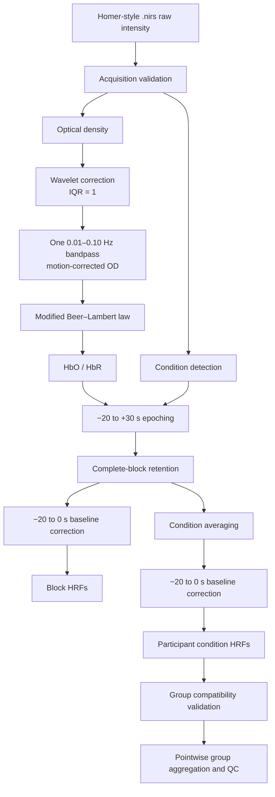

# fNIRS Vestibulo-Oculomotor Preprocessing

A validated MATLAB workflow that converts Homer-style continuous-wave fNIRS recordings into standardized participant block HRFs, participant condition HRFs, and auditable group averages.

## Overview

This repository contains the maintained preprocessing layer for an fNIRS study of cortical hemodynamic responses during upright vestibulo-oculomotor tasks. It loads continuous-wave intensity data, validates acquisition structure, delegates established numerical operations to Homer2, and produces format-neutral HbO/HbR derivatives for downstream analysis.

The code is a standardized canonical implementation informed by the final dissertation methods, historical MATLAB/Homer workflows, and downstream analysis requirements. It is not a claim of byte-for-byte reproduction of every historical script. Historical implementations contained version-dependent differences in filtering, operation order, baseline handling, and group exclusion; this repository makes one scientific path explicit and testable.

This is Repo 1 of the Aim 2 workflow. Statistical inference, ICC reliability, test-retest analysis, significant-channel figures, MNI/anatomical mapping, and cortical visualization belong in the planned companion repository `vestibulo-oculomotor-fnirs-cortical-analysis`.

## Pipeline



## Key Features

- Small MATLAB functions with explicit dimensional and metadata contracts.
- Standardized `.nirs` translation that keeps Homer2 probe context separate from format-neutral recording data.
- Acquisition validation before numerical preprocessing.
- Exact-name condition detection without position inference or fuzzy matching.
- Isolated Homer2 wrapper layer with dependency and output checks.
- Preservation of complete individual blocks and their original event ordinals.
- Participant condition-HRF generation with a single baseline convention.
- Cross-participant compatibility checks and independently audited HbO/HbR aggregation.
- Synthetic tests covering interfaces, sequencing, edge cases, and error behavior.
- No participant recordings or participant-identifiable fixtures.

## Scientific Processing Decisions

The maintained individual pipeline uses:

- wavelet motion correction with IQR `1`;
- exactly one `0.01–0.10 Hz` bandpass applied to motion-corrected optical density;
- modified Beer–Lambert conversion to HbO and HbR;
- epochs from `−20` through `+30 s`, including aligned endpoints;
- retention of complete epochs only;
- baseline correction using the mean from `−20` through `0 s`.

The group stage calculates an initial pointwise mean and sample SD (`N−1`) across participants. Values strictly greater than `2 SD` from that candidate-inclusive mean are excluded in one detection pass. Statistics are recalculated from retained values, effective sample size is reported pointwise, and excluded values are not imputed.

## Outputs

`preprocess_recording` returns:

| Output | Main dimensions | Purpose |
|---|---:|---|
| `condition_hrfs(k).HbO`, `.HbR` | time × channel | Baseline-corrected participant condition average |
| `block_hrfs(k).HbO`, `.HbR` | time × channel × retained block | Baseline-corrected complete individual blocks |
| `epoch_report(k)` | condition-level metadata | Detected, included, and boundary-excluded trial accounting |
| `preprocessing` | scalar metadata | Numerical parameters actually used |

Each condition and block derivative carries a column time vector and `channel_pairs` in maintained channel order. `block_indices` is a row vector of original within-condition event ordinals, so retained Block 2 remains identifiable as Block 2 even if Block 1 was boundary-excluded. Full block derivatives are retained because downstream analyses may use different task windows; Repo 1 does not embed a task-period summary.

`aggregate_participant_hrfs` returns group condition HRFs, parallel HbO/HbR outlier reports, and aggregation metadata. Outlier reports include initial/final statistics, masks, and pointwise included/excluded counts. Participant identifiers are neither required nor returned by the scientific functions.

## Repository Structure

```text
config/          Canonical scientific configuration and local-path template
docs/            Methods, pipeline, and historical-provenance documentation
examples/        Safe API walkthroughs without participant data
src/individual/  Loading, validation, Homer2 adapters, epoching, and preprocessing
src/group/       Pointwise exclusion and compatible participant aggregation
tests/           MATLAB function-based tests using synthetic fixtures/stubs
outputs/         Ignored destination for local generated outputs
```

Legacy analysis folders are currently tracked in this working history. They are provenance rather than maintained source and include machine-specific paths and derived CSV/ASV artifacts. They should be removed from the future public branch/history or isolated in a private provenance archive before publication; this documentation update does not alter them.

## Requirements

- MATLAB R2022b (validated environment).
- A compatible Homer2 installation for real numerical preprocessing, providing `hmrIntensity2OD`, `hmrMotionCorrectWavelet`, `hmrBandpassFilt`, and `hmrOD2Conc` on the MATLAB path.

The maintained repository source does not directly call another MATLAB toolbox API. Homer2 may have additional dependencies determined by the installed Homer2 distribution. The synthetic wrapper tests do not execute real Homer2 numerics.

## Quick Start

The following uses the actual maintained interfaces. Acquisition expectations and the input path are intentionally caller-supplied because they are study/acquisition metadata, not inferred defaults.

```matlab
addpath('config');
addpath(fullfile('src', 'individual'));
addpath(fullfile('src', 'group'));

config = canonical_preprocessing_config();

% Caller-supplied, non-versioned inputs:
% raw_file
% expected_sampling_rate_hz
% sampling_rate_tolerance_hz
% sampling_interval_tolerance_fraction
% expected_channel_count
% expected_wavelength_count

[recording, adapter_context] = load_fnirs_recording(raw_file);

requirements = struct( ...
    'expected_sampling_rate_hz', expected_sampling_rate_hz, ...
    'sampling_rate_tolerance_hz', sampling_rate_tolerance_hz, ...
    'sampling_interval_tolerance_fraction', ...
        sampling_interval_tolerance_fraction, ...
    'expected_channel_count', expected_channel_count, ...
    'expected_wavelength_count', expected_wavelength_count);

validation = validate_raw_recording(recording, requirements);
[conditions, condition_report] = detect_conditions( ...
    recording.stimuli, {'EC', 'HS', 'HVOR', 'VVOR'}, 5);

operators = homer2_preprocessing_operators(adapter_context.homer2_sd);
participant_result = preprocess_recording( ...
    recording, validation, conditions, config.individual, operators);
```

The caller should review both acquisition QC and `condition_report` before treating an output as analysis-ready. To aggregate compatible participant results:

```matlab
group_result = aggregate_participant_hrfs(participant_results, config.group);
```

Here `participant_results` is a struct vector containing the `condition_hrfs` produced for at least two participants. See [examples/README.md](examples/README.md) for contract notes.

## Testing

The current MATLAB R2022b regression at commit `7fa0886` completed with:

```text
358 tests
358 passed
0 failed
0 incomplete
```

Coverage includes loader translation, acquisition validation, condition detection, Homer2 adapter contracts, epoching, baseline correction, preprocessing orchestration, complete-block preservation, pointwise exclusion, and group aggregation. Homer2 calls are tested with temporary synthetic stubs; these tests validate this repository's boundary behavior, not the independent numerical correctness of Homer2.

## Reproducibility and Provenance

The maintained code standardizes a dissertation workflow after auditing historical MATLAB scripts with inconsistent variants. Scientific choices, known divergence, and output contracts are documented in:

- [Canonical methods](docs/methods.md)
- [Pipeline overview](docs/pipeline_overview.md)
- [Historical provenance](docs/historical_provenance.md)

## Data and Privacy

No participant recordings or identifiable participant data should be included. Tests use deterministic synthetic matrices and temporary synthetic `.nirs`/Homer stubs where needed. Machine-specific paths belong only in ignored local configuration such as `config/local_paths.m`.

## Related Scientific Work

This preprocessing workflow supports research on cortical hemodynamic responses during vestibulo-oculomotor tasks. A related manuscript is under review at *Brain Topography*. Scientific findings and publication-result figures are intentionally outside this preprocessing repository.

## Limitations

- The maintained loader supports MAT-format Homer-style `.nirs` files; SNIRF is not currently supported.
- Real numerical preprocessing depends on external Homer2 functions.
- Synthetic wrapper tests do not independently validate Homer2's scientific algorithms.
- The configured DPF `[6 6]` is historically observed but must be verified against authoritative acquisition records before being described as a confirmed dissertation parameter.
- This is a canonical maintained implementation, not exact reproduction of every historical script.
- Scientific inference, ICC, anatomical mapping, and publication figures belong to Repo 2.
